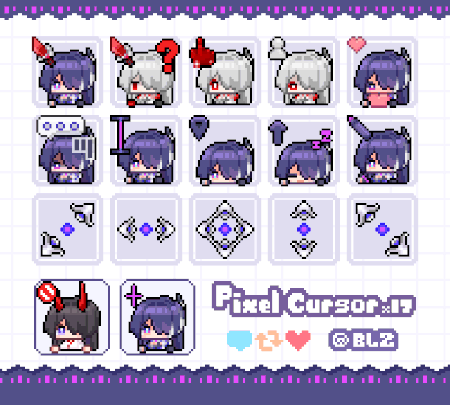
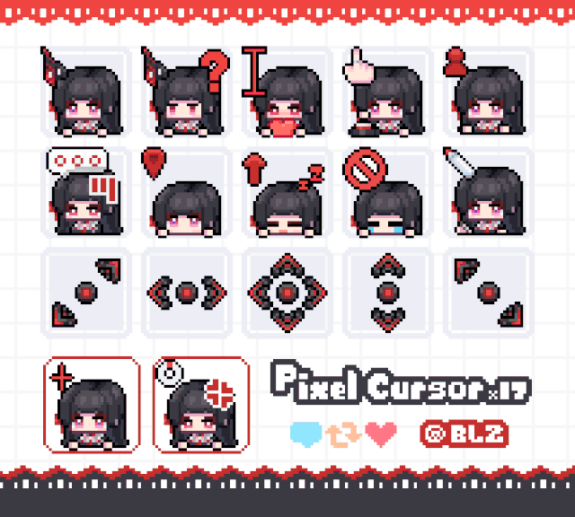
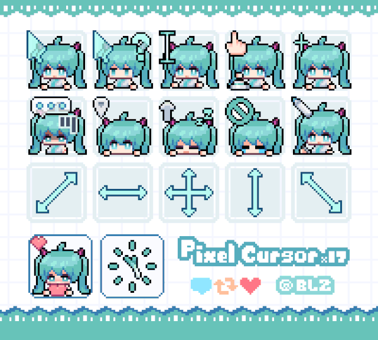
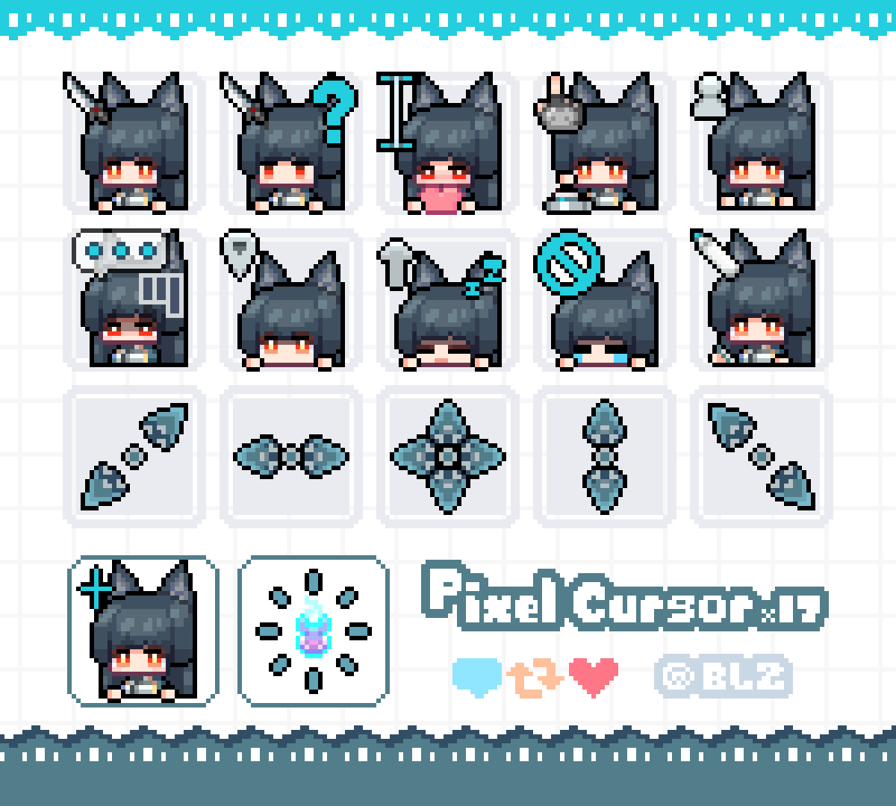

# Table of Contents

1.  [AniCursors](#org373d0f2)
    1.  [Installation](#orgb286d0e)
    2.  [Cursors](#orgb918724)

# AniCursors

This is a nix flake that provides that provides a collection of anime cursors for NixOS

## Installation

Add AniCursors to your flake.nix inputs

    inputs = {
      anicursors = {
        url = "github:0x2B-bin/AniCursors";
        inputs.nixpkgs.follows = "nixpkgs";
      };
    };

Then add the cursor you want into environment.systemPackages like so

    environment.systemPackages = [
      inputs.anicursors.default # For all cursors
      inputs.anicursors.acheron_blz # Just acheron cursor
      inputs.anicursors.chisa_blz # Just chisa cursor
      # So on...
    ];

## Cursors

Here is a gallery of the available cursors

<table>
  <tr>
    <td align="center">
      <b>acheron_blz</b> 
      
    </td>
    <td align="center">
      <b>chisa_blz</b> 
      
    </td>
  </tr>
  <tr>
    <td align="center">
      <b>miku_blz</b> 
      
    </td>
    <td align="center">
      <b>miyabi_blz</b> 
      
    </td>
  </tr>
</table

