# Table of Contents

1.  [AniCursors](#org92572f4)
    1.  [Installation](#org75f8e35)
    2.  [Cursors](#org0c707a4)


<a id="org92572f4"></a>

# AniCursors

This is a nix flake that provides that provides a collection of anime cursors for NixOS


<a id="org75f8e35"></a>

## Installation

Add AniCursors to your flake.nix inputs
```nix
inputs = {
  anicursors = {
    url = "github:0x2B-bin/AniCursors";
    inputs.nixpkgs.follows = "nixpkgs";
  };
};
```

Then add the cursor you want into environment.systemPackages like so

```nix
environment.systemPackages = [
  inputs.anicursors.default # For all cursors
  inputs.anicursors.acheron_blz # Just acheron cursor
  inputs.anicursors.chisa_blz # Just chisa cursor
  # So on...
];
```


<a id="org0c707a4"></a>

## Cursors

Here is a gallery of the available cursors

<table>
  <tr>
    <td align="center">
      <b>acheron_blz (@BLZ)</b><br><br>
      
    </td>
    <td align="center">
      <b>amiya_blz (@BLZ)</b><br><br>
      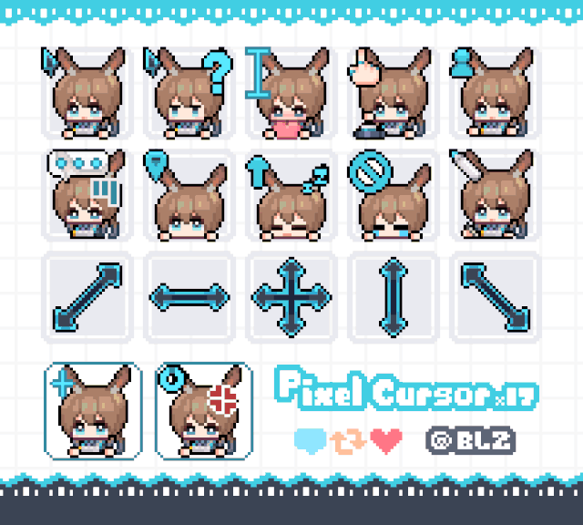
    </td>
  </tr>

  <tr>
    <td align="center">
      <b>burnice_blz (@BLZ)</b><br><br>
      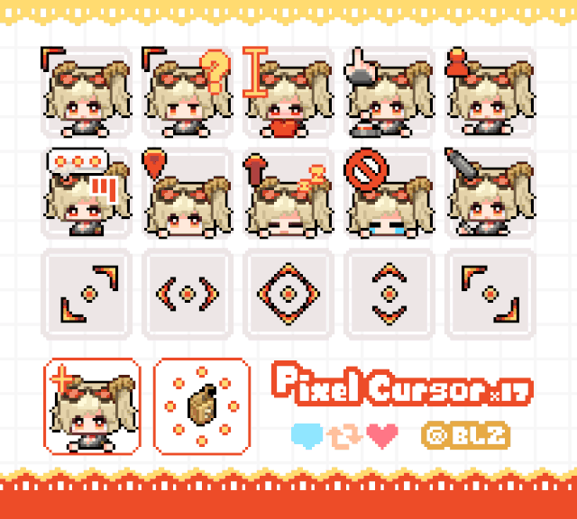
    </td>
    <td align="center">
      <b>chisa_blz (@BLZ)</b><br><br>
      
    </td>
  </tr>

  <tr>
    <td align="center">
      <b>evernight_blz (@BLZ)</b><br><br>
      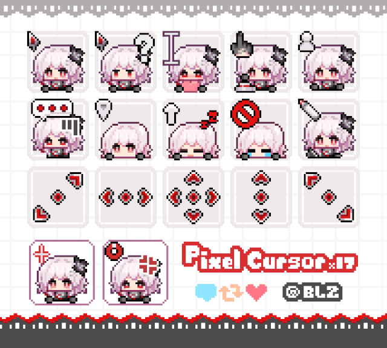
    </td>
    <td align="center">
      <b>furina_blz (@BLZ)</b><br><br>
      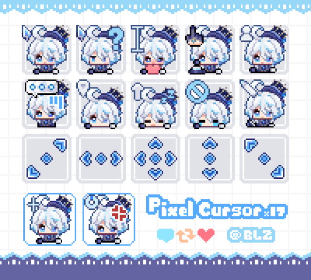
    </td>
  </tr>

  <tr>
    <td align="center">
      <b>jane_blz (@BLZ)</b><br><br>
      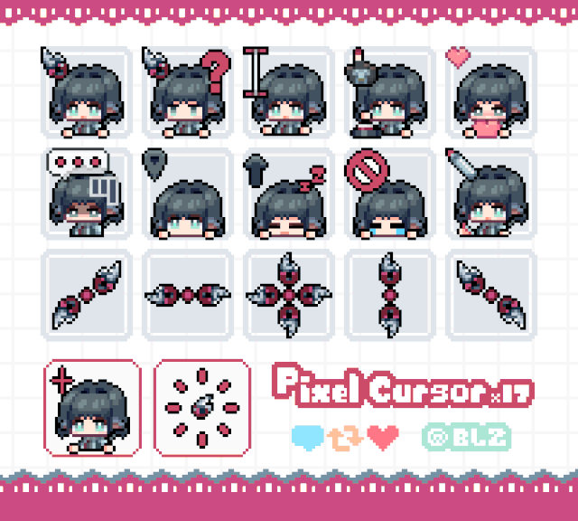
    </td>
    <td align="center">
      <b>kurumi_blz (@BLZ)</b><br><br>
      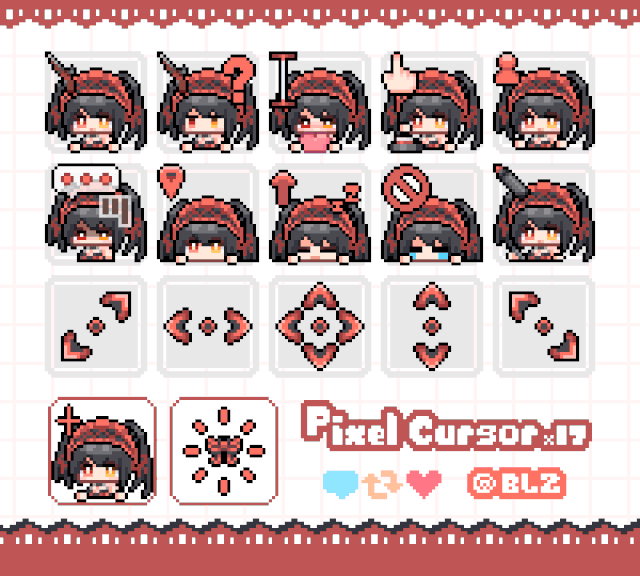
    </td>
  </tr>

  <tr>
    <td align="center">
      <b>lupa_blz (@BLZ)</b><br><br>
      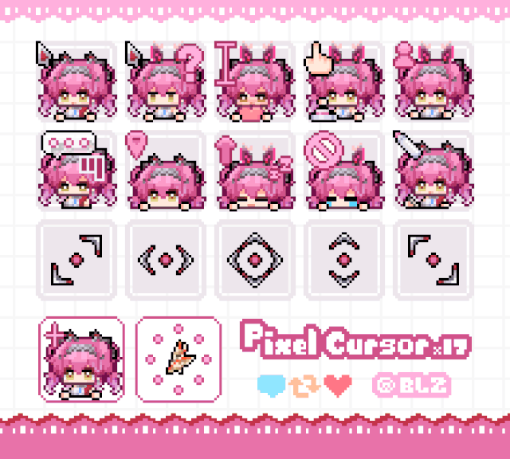
    </td>
    <td align="center">
      <b>miku_blz (@BLZ)</b><br><br>
      
    </td>
  </tr>

  <tr>
    <td align="center">
      <b>mita_blz (@BLZ)</b><br><br>
      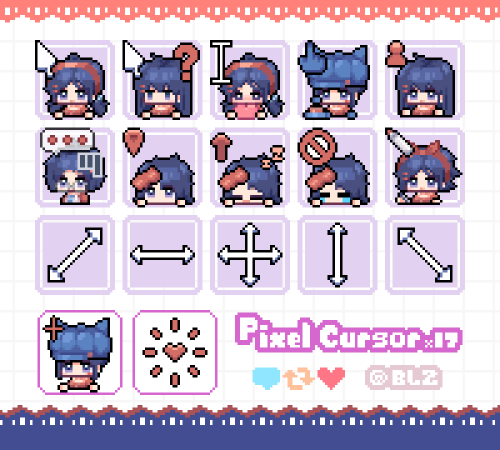
    </td>
    <td align="center">
      <b>miyabi_blz (@BLZ)</b><br><br>
      
    </td>
  </tr>

  <tr>
    <td align="center">
      <b>perlica_blz (@BLZ)</b><br><br>
      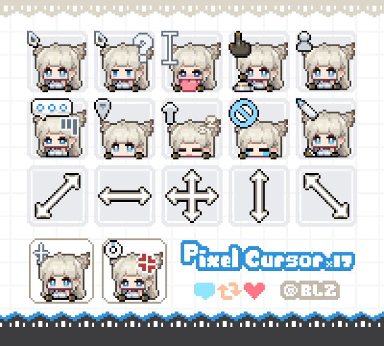
    </td>
    <td align="center">
      <b>silver_wolf_blz (@BLZ)</b><br><br>
      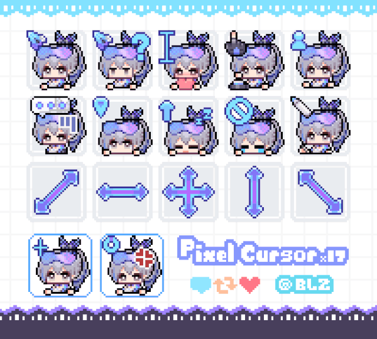
    </td>
  </tr>

  <tr>
    <td align="center">
      <b>sparkle_blz (@BLZ)</b><br><br>
      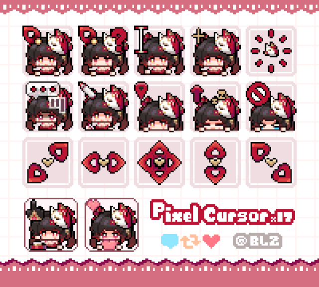
    </td>
    <td align="center">
      <b>yuzuha_blz (@BLZ)</b><br><br>
      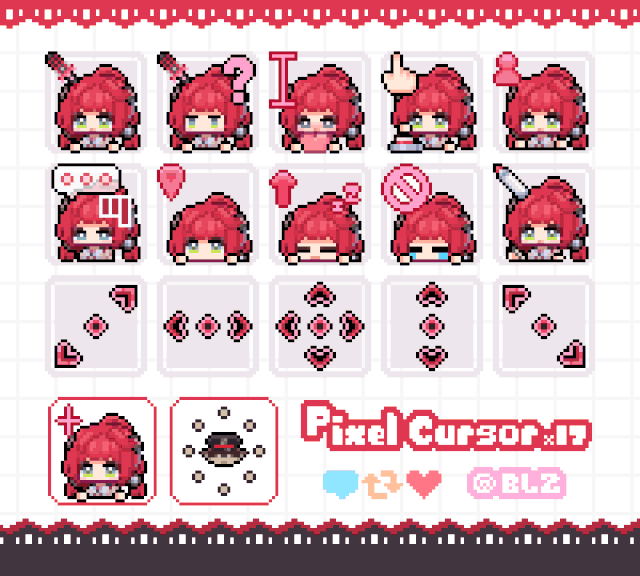
    </td>
  </tr>
</table>
